<div align="center">

# 🚀 OmniSpace AI

**本地优先的全栈 AI 漫剧创作工作站**

<p align="center">
  <a href="#-界面预览">界面预览</a> •
  <a href="#-核心特性">核心特性</a> •
  <a href="#-技术栈">技术栈</a> •
  <a href="#-快速开始">快速开始</a> •
  <a href="#-内部开发流程">内部开发流程</a> •
  <a href="#-路线图">路线图</a>
</p>

<p align="center">
  
  
  
  
  
  
</p>

> 💡 **对话 × 漫画 × 漫剧 × 写作 × 知识学习**
> 默认全部推理在 **本地 GPU** 完成；如需更强模型，可自带 Key 选接云端 API（明确标注、可关闭）

</div>

---

## 🌟 为什么 OmniSpace 值得选择

这不是又一个 AI 玩具 —— 这是一个**完整的、工程化的、可落地的本地 AI 创作平台**。

| 亮点 | 说明 |
|------|------|
| 🎯 **真·全模态** | 文本 / 图像 / 视频 / 语音 / 知识图谱，一站式创作管线 |
| 🏠 **本地优先** | 默认所有模型推理跑在你自己的 GPU 上，数据不出本机；云端 API 是可选的自带 Key 档位 |
| ⚡ **显存调度器** | 自研显存协调器（账本/准入/单一编排），16GB 消费级显卡可跑各条创作链路（自动加载/卸载/互斥/让档，持续调优中） |
| 🩺 **自愈与体检** | 模型未加载自动加载并续跑、一键体检（8 项只读检查）+ 白名单修复、错误必带出路指引 |
| 🏗️ **工程质量高** | ≈370 个 HTTP 端点（含别名，2026-09-11 静态统计）+ WebSocket 状态通道；pytest **690+ 用例**（GPU 集成显式开关）/ vitest **75 用例** / 活后端 E2E 三层测试体系 |
| 🧩 **插件式推理引擎** | vLLM / llama.cpp (GGUF) / Transformers 多后端，可热切换、可自动降级 |
| 📚 **丰富文档** | 架构图、API 文档、部署手册、故障排查，新人友好 |

---

## 📸 界面预览

<div align="center">

**启动页 · 点火序列 HUD**（环境自检 → 后端服务 → 模型预热 → 就绪）

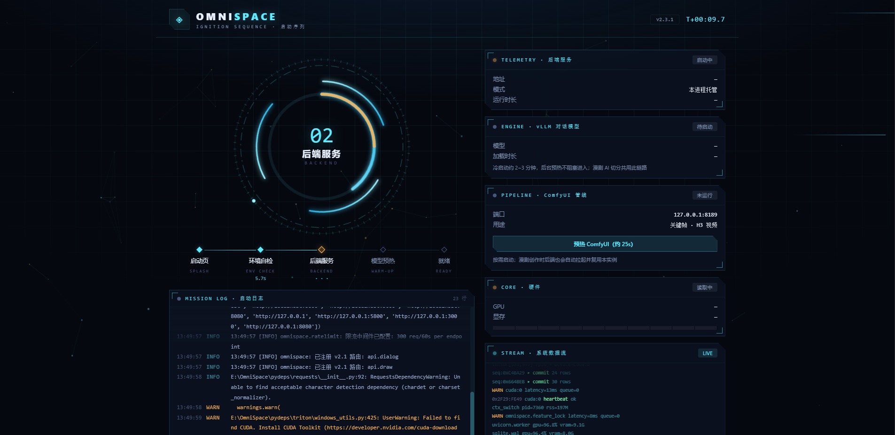

<br/><br/>

🎬 **[▶️ 观看演示视频 —— AI 生成漫剧成片（11 秒）](docs/promo/demo-video.mp4)**

<br/>

<table>
<tr>
<td width="50%" align="center">
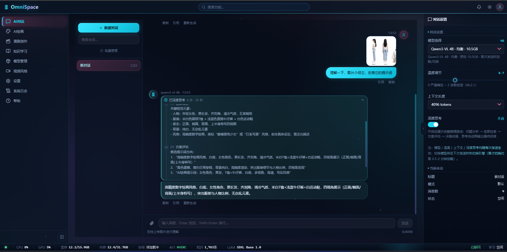<br><sub><b>AI 对话</b> · 本地多模态推理 / 流式输出 / 深度思考</sub>
</td>
<td width="50%" align="center">
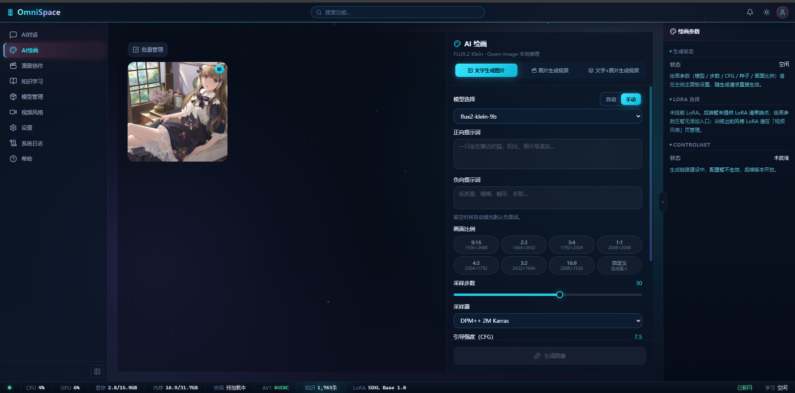<br><sub><b>AI 绘画</b> · FLUX.2 Klein 本地文生图 / 多比例出图</sub>
</td>
</tr>
<tr>
<td width="50%" align="center">
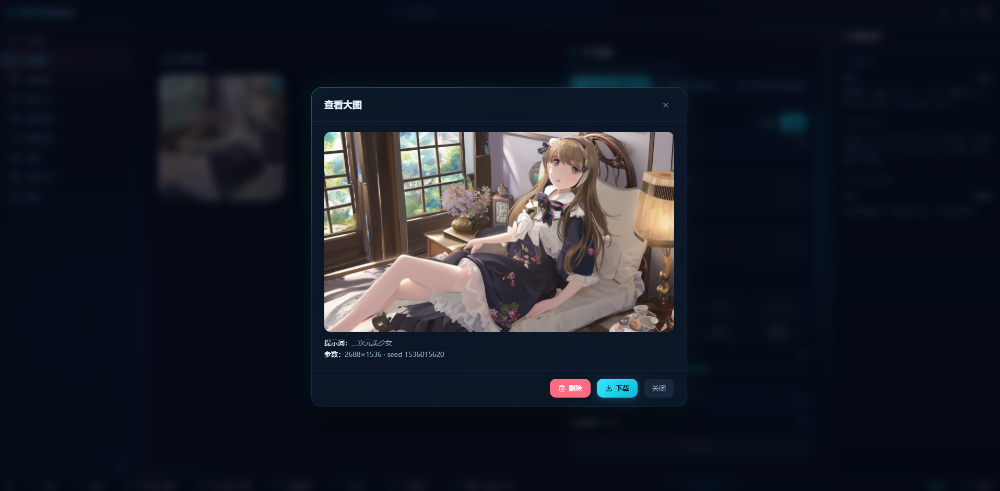<br><sub><b>出图效果</b> · 2688×1536 高清成图</sub>
</td>
<td width="50%" align="center">
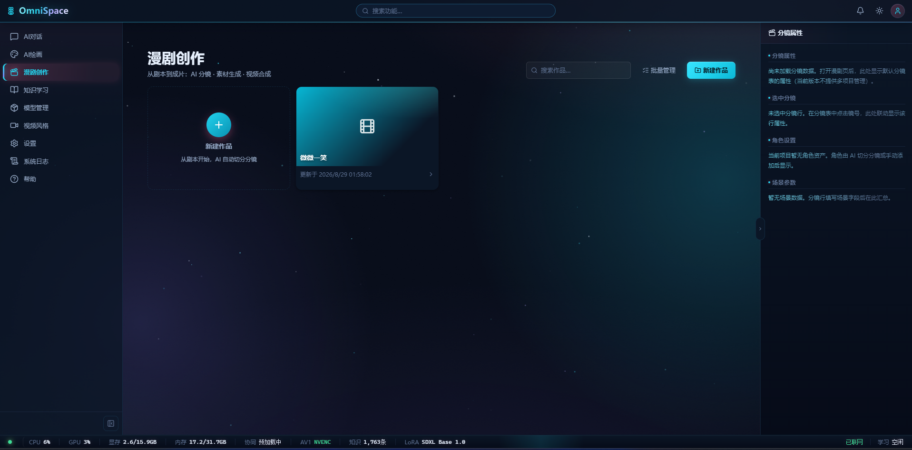<br><sub><b>漫剧创作</b> · 从剧本到成片的工作台</sub>
</td>
</tr>
<tr>
<td width="50%" align="center">
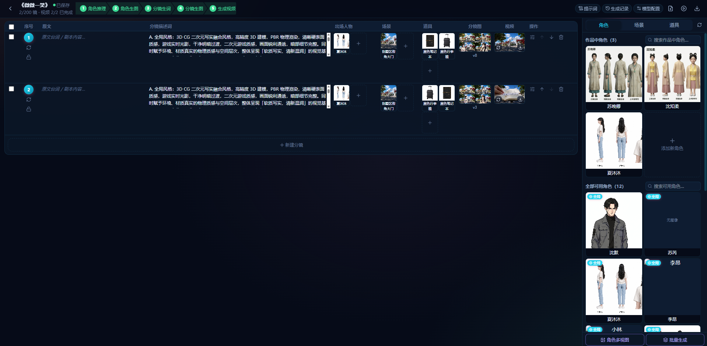<br><sub><b>分镜编辑器</b> · 角色/场景/道具资产 + 四视图一致性</sub>
</td>
<td width="50%" align="center">
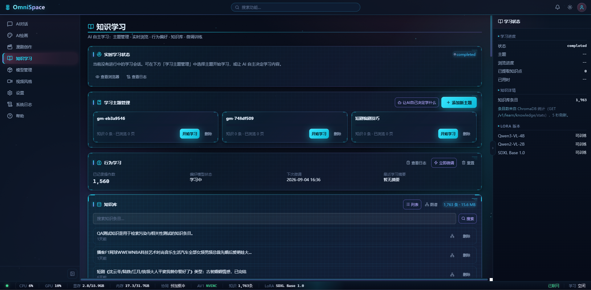<br><sub><b>知识学习</b> · AI 自主学习 + 知识库 RAG</sub>
</td>
</tr>
<tr>
<td width="50%" align="center">
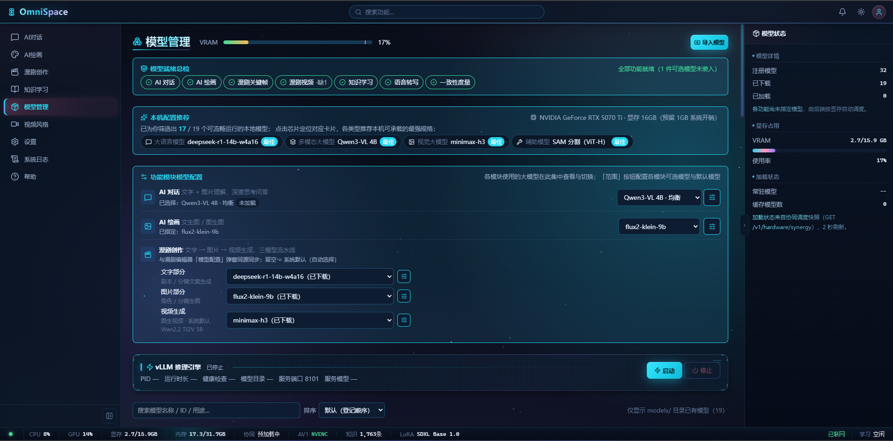<br><sub><b>模型管理</b> · 本地模型装载 / 显存监控 / 就绪体检</sub>
</td>
<td width="50%" align="center">
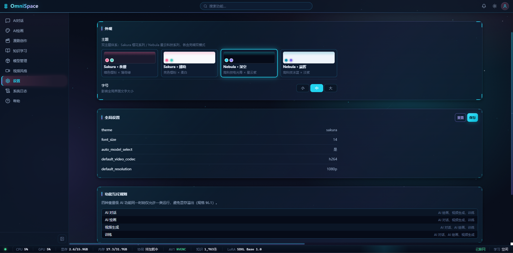<br><sub><b>个性化</b> · 双主题族 × 亮暗模式</sub>
</td>
</tr>
<tr>
<td width="50%" align="center">
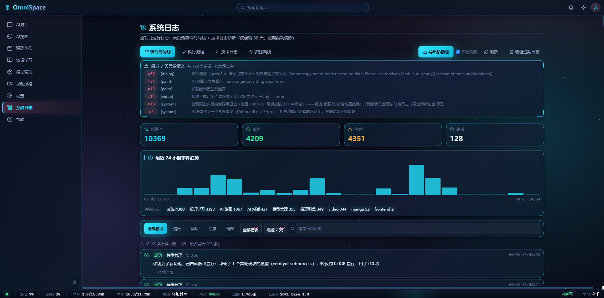<br><sub><b>系统日志</b> · 大白话事件时间线 + 异常聚合</sub>
</td>
<td width="50%" align="center">
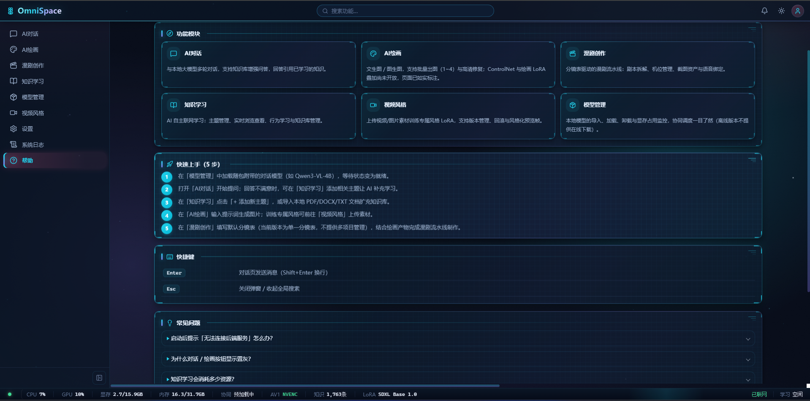<br><sub><b>帮助中心</b> · 功能总览 + 新手五步上手</sub>
</td>
</tr>
</table>

</div>

---

## ✨ 核心特性

### 🎨 AI 漫画（Comic）
- **参考图角色一致性**：角色参考图锚定跨格统一（角色 LoRA 当前接入漫剧关键帧链；漫画分格链接入见未完成清单）
- **四视图生成**：角色设定图一键出三视图/四视图
- **AI 写分格**：从剧本文本自动划分漫画格
- **台词气泡**：多角色台词、名字角标、气泡拖拽编辑
- **资产库**：角色 / 场景 / 道具三页签，支持上传与 AI 生成
- **整页导出与阅读预览**

### 🎬 AI 漫剧（Manga）
- **分镜编辑器**：剧情 → 分镜 → 资产 → 关键帧 → 视频 → 成片全链路
- **多角色一致性**：跨镜形象统一（双硬锁并发保护）
- **视频生成**：主力 MiniMax H3 多镜链式生成（本地 ComfyUI 推理），Wan2.2-ti2v-5b 图生视频补档；视频队列排队/取消/进度可视
- **镜头语言结构化**：A/B/C 三段式提示词 + 中文导演运镜 + 台词行
- **风格包**：30 个预置视频/画风风格包，一键套用
- **资产库管理**：角色、场景、道具系统化管理

### 💬 AI 对话（Dialog）
- 多引擎本地对话（vLLM / llama.cpp GGUF / Transformers，按显存自动路由）
- 流式输出（SSE），打字机效果
- 上下文记忆 + 知识库 RAG
- 排队不秒拒、自动降级明示（装不下的模型自动换档并提示）

### ✍️ 写作台（Novel）
- 长篇小说 / 剧本创作
- 剧本可一键结构化，直接喂给漫画分格与漫剧分镜

### 🧠 知识学习（Learn）
- 文档 / 图片自动向量化入库（多道入库质检闸）
- RAG 检索增强生成（向量 + FTS5 全文 + RRF 融合）
- 知识图谱可视化
- 浏览器代理，自主上网学习

### 🔊 语音能力（Voice）
- TTS 文字转语音（Windows SAPI5 本地语音）+ Whisper 本地语音识别
- 已内置于漫剧配音链路；AI 声音克隆模型为门控实验功能（默认关闭）

---

## 🛠 技术栈

| 层级 | 技术 |
|------|------|
| **前端** | React 19.0 + TypeScript + Vite 6 + Tailwind CSS v4 + Zustand 5 + React Router 7（Hash 路由，六主题族可切换） |
| **后端** | FastAPI 0.141.1 + Pydantic v2 + uvicorn（Python 3.10.11 嵌入式 runtime） |
| **AI 推理** | PyTorch 2.13 (cu130) + Diffusers + Transformers；对话引擎 vLLM 0.27.1 子进程（py313）与 llama.cpp GGUF / Transformers 热切换 |
| **数据库** | SQLite (WAL) + ChromaDB + FTS5 全文检索 |
| **存储加密** | AES-256-GCM 字段级加密（对话正文/行为日志）+ DPAPI 密钥保护 |
| **交付形态** | launcher 守护进程 + 系统浏览器 / 内嵌 WebView 壳（设置页可选）；Tauri 已于 2026-08-20 经 [ADR-002](docs/ADR-002-tauri-shell-decision.md) 裁剪 |
| **测试** | pytest（690+ 用例，GPU 集成显式开关）+ vitest（75 用例）+ 活后端 E2E 流程编排 |
| **代码质量** | ruff + mypy 基线闸（只增不减）+ pre-commit hooks |

---

## 📁 项目结构

```
OmniSpace/
├── src/               # 后端 + 内核统一扁平包（原 src/ + DistributedFormer 内核）
│   ├── api/               # 路由层（dialog / comic / manga / novel / learn / models …）
│   ├── services/          # 业务层 + 推理引擎 + 模型管理（含 Transformers 后端）
│   ├── engines/           # 资源层（GPU / VRAM / 内存管理）
│   ├── data/              # 存储层（DB / 向量 / 全文 / 图谱 / 加密）+ Rust 训练语料
│   ├── middleware/        # 横切层（错误处理 / 限流 / 互斥锁 / CORS）
│   ├── core/              # 内核层：DistributedFormer 脉冲主模型（CubeGPT）
│   ├── cutemamen/         # 内核层：CuteMamen 插件内核（路由/生命周期/三级记忆/包格式）
│   ├── codec/             # 内核层：脉冲 / 多模态编解码
│   └── training/          # 内核层：主模型 → 插件 知识迁移读出层
├── plugin/            # CuteMamen 插件包（.CuteMamen，自包含：manifest+权重+记忆）
├── frontend/              # React SPA
├── launcher/              # 启动守护进程（自检/端口/心跳/重启/启动页）
├── docs/                  # 完整文档（含 AGENTS.md / CLAUDE.md）
├── tools/                 # 构建与诊断脚本（第三方工具树不入库）
└── tests/                 # tests/unit 单元测试 + E2E 流程编排
```

---

## 🚀 快速开始

### 前置要求

- Windows 10/11
- NVIDIA GPU（≥ 16GB 显存推荐，8GB 可精简运行）
- CUDA 12.x
- ≥ 50GB 磁盘空间（模型文件）

### 启动

```powershell
# 进入项目目录（私有仓库，不对外分发）
cd E:\OmniSpace

# 方式一：双击 启动OmniSpace.bat（免黑窗可用桌面快捷方式）

# 方式二：命令行启动（需先配置模型文件，详见部署手册）
runtime\py310\python.exe launcher\launcher.py
```

浏览器会自动打开 `http://127.0.0.1:8765`

> 端口说明：launcher 默认 `--port 8765`（冲突时先清理残留进程，再扫描 5800–5835 递进）；
> 开发模式直接跑 uvicorn 时用 `config.yaml` 里的 5800。

### 开发模式

```powershell
# 后端（端口 5800）
runtime\py310\python.exe -m uvicorn src.main:app --reload

# 前端（端口 5173，自动代理 API）
cd frontend
pnpm install
pnpm dev
```

---

## 🤝 开发流程

公开仓库，仅协作开发。

### 💡 协作方向

| 方向 | 适合人群 | 入门难度 |
|------|---------|---------|
| 🐛 **Bug 修复** | 所有人 | ⭐ |
| 📝 **文档完善** | 技术写作爱好者 | ⭐ |
| 🎨 **UI/UX 优化** | 前端/设计师 | ⭐⭐ |
| 🔧 **新功能开发** | 全栈开发者 | ⭐⭐⭐ |
| 🧠 **模型集成** | AI 算法工程师 | ⭐⭐⭐⭐ |
| ⚡ **性能优化** | 资深工程师 | ⭐⭐⭐⭐ |

### 🚀 快速上手

1. **创建分支**
   ```bash
   git checkout -b feature/你的功能名
   ```
2. **提交更改**
   ```bash
   git commit -m "feat: 添加了什么功能"
   ```
3. **本地合并**（自测通过后合回 main）
   ```bash
   git checkout main && git merge feature/你的功能名
   ```

### 📋 上手建议

想找容易上手的任务？关注以下方向：
- 前端 UI 细节优化（动画、交互、响应式）
- 后端 API 补充单元测试
- 文档翻译与润色
- 添加更多模型支持

### 📐 代码规范

- 后端：遵循 `ruff.toml` 配置，提交前跑 `ruff check`
- 前端：TypeScript strict 模式，遵循项目已有代码风格
- 提交信息：`feat: / fix: / docs: / refactor: / perf:` 前缀

---

## 🗺 路线图（Roadmap）

> 项目处于**持续开发中**：以下清单只代表"到今天为止做了什么"，不代表"做完了"。
> 功能均可打磨，发现问题欢迎提 Issue / 直接动手修。

### 🧩 当前已具备的能力（不代表完成，持续打磨中）
- [x] 基础架构搭建（FastAPI + React）
- [x] AI 对话模块（多引擎本地推理 + RAG 混合检索 + 排队与降级明示）
- [x] AI 漫画模块（参考图一致性 / 角色 LoRA / AI 分格 / 台词气泡 / 整页导出 / 资产库）
- [x] 漫剧创作模块（分镜→资产→关键帧→视频链路已可跑通，MiniMax H3 链式生成主力）
- [x] 写作台（小说/剧本创作，剧本直通漫画与漫剧）
- [x] 知识学习与 RAG（ChromaDB + FTS5 + RRF 融合，图片知识入库）
- [x] 显存协调器（账本/准入/编排重构）与功能互斥锁
- [x] 一键体检与自愈机制（错误出路指引 / 事件日志自动兜底 / 模型自动加载）
- [x] 可选云端 API 接入（文本 / 图像可用，视频适配器为 DashScope 形态、MiniMax 通道待通，自带 Key）
- [x] 多主题族界面（含治愈系「Dali·风花雪月」六态主题）

> 注：图生 3D（TripoSR）后端管线与 3D 导演台曾实现，后者已于 2026-08-29 裁定整链路剔除；/art 视觉工具端点后端保留、暂无前端入口。上表各项均为"可运行"状态，效果与稳定性仍在迭代。

### 🔄 进行中
- [ ] 联网搜索 v1（免费双通道：无头浏览器自搜 + SearXNG 自建）
- [ ] 多显卡实机验证
- [ ] 语音克隆门控开放评估

### 🔮 规划中
- [~] 插件系统（第三方模型/功能扩展）——OSP v1 已上线 P1/P2：插件运行时 + 漫剧关键帧快速预览（2026-09-16）；外轨契约与插件管理页推进中
- [ ] 多人协作创作
- [ ] 社区素材共享平台
- [ ] Linux / macOS 支持
- [ ] 更多模型生态接入

> 💡 **有想法？直接在团队内部讨论！** 我们非常欢迎新的创意和建议。

---

## 📚 文档索引

| 文档 | 内容 | 何时看 |
|------|------|--------|
| [部署手册](docs/deployment-manual.md) | 硬件要求、环境装配、模型配置 | 第一次部署 |
| [开发者快速上手指南](docs/开发者快速上手指南.md) | **从克隆到联调/测试/提交的开发环境逐步搭建** | 第一次参与开发 |
| [架构总览](docs/design/architecture-overview.md) | 分层结构、中间件链、数据流 | 理解系统设计 |
| [API 端点总表](docs/design/api-endpoints.md) | HTTP / WS 端点文档（快照，增量以代码为准） | 开发对接 |
| [数据库 ER](docs/design/database-er.md) | 数据库表结构与迁移说明 | 数据库相关 |
| [故障排查](docs/troubleshooting.md) | OOM / 端口冲突 / 模型加载失败 | 出问题时 |
| [需求追踪矩阵](docs/requirements-traceability.md) | 功能/模块/架构/工程四类需求追踪 | 查需求状态 |

---

## 📄 License

版权所有 © 2026 OmniSpace。保留所有权利（All Rights Reserved）。

**本项目仅供学习使用，商业授权请+Q 3559331368。**

本项目为半开源软件，未经授权不得复制、分发、反向工程或二次开发，仅供学习，未经授权不得商业行为（除非成为技术合伙人共同开发）。正式商业授权协议（EULA）随发行版提供。

---

<div align="center">

**用 AI 释放创作力 · OmniSpace**

Made with ❤️ by the OmniSpace Team

</div>
